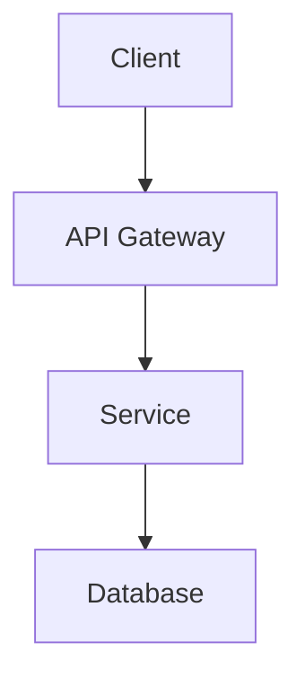

# Markdown Render API - Linux Server Documentation

A high-performance FastAPI application for rendering Markdown documents to PDF and DOCX formats with advanced features including Mermaid diagrams, table parsing, and pagination.

## 🚀 Features

- **PDF Generation**: High-quality PDF rendering with ReportLab and WeasyPrint
- **DOCX Generation**: Professional DOCX documents with Pandoc and html2docx
- **Mermaid Diagrams**: Visual diagram rendering (flowcharts, sequence diagrams, etc.)
- **Table Support**: Proper table parsing without separator artifacts
- **Pagination**: Professional headers and footers with page numbers
- **Document Styling**: Custom CSS support and GitHub-like markdown rendering
- **Error Handling**: Robust fallback mechanisms and graceful degradation

## 📋 Prerequisites

### System Requirements
- **OS**: Linux (Ubuntu 20.04+, CentOS 7+, or similar)
- **Python**: 3.8 or higher
- **Memory**: Minimum 2GB RAM (4GB+ recommended)
- **Storage**: 1GB free space for dependencies

### Required System Packages
```bash
# Ubuntu/Debian
sudo apt-get update
sudo apt-get install -y python3 python3-pip python3-venv python3-dev
sudo apt-get install -y build-essential libssl-dev libffi-dev

# CentOS/RHEL/Fedora
sudo yum install -y python3 python3-pip python3-devel gcc openssl-devel libffi-devel
# or for newer versions:
sudo dnf install -y python3 python3-pip python3-devel gcc openssl-devel libffi-devel
```

## 🔧 Installation Guide

### Step 1: Clone and Setup Project

```bash
# Clone your repository (replace with your actual repo URL)
git clone <your-repository-url>
cd markdown-render-api

# Create virtual environment
python3 -m venv venv
source venv/bin/activate

# Upgrade pip
pip install --upgrade pip
```

### Step 2: Install Python Dependencies

```bash
# Install core dependencies
pip install fastapi uvicorn reportlab python-docx pillow
pip install markdown-it pygments requests pypandoc html2docx
pip install pydantic python-multipart

# Optional: Install additional dependencies for enhanced features
pip install weasyprint  # Better PDF rendering (requires system deps)
```

### Step 3: Install System Dependencies (Optional but Recommended)

#### For WeasyPrint (Enhanced PDF Rendering)
```bash
# Ubuntu/Debian
sudo apt-get install -y libpango1.0-dev libharfbuzz-dev libffi-dev libglib2.0-dev libcairo2-dev

# CentOS/RHEL
sudo yum install -y pango-devel harfbuzz-devel libffi-devel glib2-devel cairo-devel
```

#### For Mermaid CLI (Diagram Rendering)
```bash
# Install Node.js
curl -fsSL https://deb.nodesource.com/setup_18.x | sudo -E bash -
sudo apt-get install -y nodejs

# Install Mermaid CLI globally
npm install -g @mermaid-js/mermaid-cli
```

#### For Pandoc (DOCX Generation)
```bash
# Ubuntu/Debian
sudo apt-get install -y pandoc

# CentOS/RHEL
sudo yum install -y pandoc

# Or download from: https://pandoc.org/installing.html
```

### Step 4: Verify Installation

```bash
# Test the API
python pdf_docx_api.py
```

You should see output like:
```
INFO:     Started server process [12345]
INFO:     Waiting for application startup.
INFO:     Application startup complete.
INFO:     Uvicorn running on http://127.0.0.1:8000
```

## 🚀 Running the API

### Development Mode

```bash
# Activate virtual environment
source venv/bin/activate

# Run with auto-reload
uvicorn pdf_docx_api:app --host 0.0.0.0 --port 8000 --reload
```

### Production Mode

#### Option 1: Direct Uvicorn
```bash
# Run in production mode
uvicorn pdf_docx_api:app --host 0.0.0.0 --port 8000 --workers 4
```

#### Option 2: With Gunicorn (Recommended for Production)
```bash
# Install Gunicorn
pip install gunicorn

# Run with Gunicorn
gunicorn pdf_docx_api:app -w 4 -k uvicorn.workers.UvicornWorker --bind 0.0.0.0:8000
```

#### Option 3: Systemd Service (Recommended for Server Deployment)

Create a systemd service file:

```bash
sudo nano /etc/systemd/system/markdown-api.service
```

Add the following content:

```ini
[Unit]
Description=Markdown Render API
After=network.target

[Service]
Type=exec
User=www-data
Group=www-data
WorkingDirectory=/path/to/your/api/directory
Environment=PATH=/path/to/your/api/directory/venv/bin
ExecStart=/path/to/your/api/directory/venv/bin/uvicorn pdf_docx_api:app --host 0.0.0.0 --port 8000
Restart=always
RestartSec=3

[Install]
WantedBy=multi-user.target
```

Enable and start the service:

```bash
# Reload systemd
sudo systemctl daemon-reload

# Enable service to start on boot
sudo systemctl enable markdown-api

# Start the service
sudo systemctl start markdown-api

# Check status
sudo systemctl status markdown-api

# View logs
sudo journalctl -u markdown-api -f
```

## 🌐 Nginx Configuration (Optional)

For production deployment with Nginx as a reverse proxy:

```bash
# Install Nginx
sudo apt-get install nginx

# Create configuration
sudo nano /etc/nginx/sites-available/markdown-api
```

Add the following configuration:

```nginx
server {
    listen 80;
    server_name your-domain.com;  # Replace with your domain

    location / {
        proxy_pass http://127.0.0.1:8000;
        proxy_set_header Host $host;
        proxy_set_header X-Real-IP $remote_addr;
        proxy_set_header X-Forwarded-For $proxy_add_x_forwarded_for;
        proxy_set_header X-Forwarded-Proto $scheme;
        
        # Increase timeout for large document processing
        proxy_read_timeout 300s;
        proxy_connect_timeout 75s;
    }
}
```

Enable the site:

```bash
# Enable site
sudo ln -s /etc/nginx/sites-available/markdown-api /etc/nginx/sites-enabled/

# Test configuration
sudo nginx -t

# Restart Nginx
sudo systemctl restart nginx
```

## 📖 API Usage

### Endpoints

| Method | Endpoint | Description |
|--------|----------|-------------|
| `GET` | `/` | API information and documentation |
| `GET` | `/health` | Health check with feature status |
| `POST` | `/render/pdf` | Generate PDF from markdown |
| `POST` | `/render/pdf-raw` | Generate PDF (raw JSON) |
| `POST` | `/render/docx` | Generate DOCX from markdown |
| `POST` | `/render/docx-raw` | Generate DOCX (raw JSON) |

### Request Format

```json
{
    "markdown": "# Your Markdown Content\n\nWith tables, diagrams, etc.",
    "filename": "document_name",
    "css": "/* Optional custom CSS */"
}
```

### Example Usage

#### Using curl
```bash
# Generate PDF
curl -X POST "http://your-server:8000/render/pdf" \
     -H "Content-Type: application/json" \
     -d '{
         "markdown": "# Test Document\n\nThis is a test.",
         "filename": "test_document"
     }' \
     --output test_document.pdf

# Generate DOCX
curl -X POST "http://your-server:8000/render/docx" \
     -H "Content-Type: application/json" \
     -d '{
         "markdown": "# Test Document\n\nThis is a test.",
         "filename": "test_document"
     }' \
     --output test_document.docx
```

#### Using Python requests
```python
import requests

# API endpoint
url = "http://your-server:8000/render/pdf"

# Markdown content
markdown_content = """# System Architecture

## Overview
This document describes the system architecture.

## Architecture Diagram



## Features Table

| Feature | Status | Notes |
|---------|--------|-------|
| API | ✅ Complete | RESTful design |
| Database | ✅ Complete | PostgreSQL |
| Auth | ✅ Complete | JWT tokens |
"""

# Request data
data = {
    "markdown": markdown_content,
    "filename": "system_architecture",
    "css": None
}

# Make request
response = requests.post(url, json=data)

if response.status_code == 200:
    with open("system_architecture.pdf", "wb") as f:
        f.write(response.content)
    print("PDF generated successfully!")
else:
    print(f"Error: {response.status_code} - {response.text}")
```

## 🔍 Health Check

Check if your API is running correctly:

```bash
curl http://your-server:8000/health
```

Expected response:
```json
{
    "status": "healthy",
    "features": {
        "pdf_rendering": true,
        "weasyprint_available": true,
        "reportlab_available": true,
        "docx_rendering": true,
        "pandoc_available": true,
        "html2docx_available": true,
        "mermaid_rendering": true
    }
}
```

## 🐳 Docker Deployment (Alternative)

Create a `Dockerfile`:

```dockerfile
FROM python:3.9-slim

# Install system dependencies
RUN apt-get update && apt-get install -y \
    build-essential \
    libpango1.0-dev \
    libharfbuzz-dev \
    libffi-dev \
    libglib2.0-dev \
    libcairo2-dev \
    pandoc \
    curl \
    && rm -rf /var/lib/apt/lists/*

# Install Node.js and Mermaid CLI
RUN curl -fsSL https://deb.nodesource.com/setup_18.x | bash - \
    && apt-get install -y nodejs \
    && npm install -g @mermaid-js/mermaid-cli

# Set working directory
WORKDIR /app

# Copy requirements and install Python dependencies
COPY requirements.txt .
RUN pip install --no-cache-dir -r requirements.txt

# Copy application code
COPY pdf_docx_api.py .

# Expose port
EXPOSE 8000

# Run the application
CMD ["uvicorn", "pdf_docx_api:app", "--host", "0.0.0.0", "--port", "8000"]
```

Build and run:

```bash
# Build image
docker build -t markdown-api .

# Run container
docker run -d -p 8000:8000 --name markdown-api markdown-api
```

## 🔧 Troubleshooting

### Common Issues

#### 1. WeasyPrint Installation Fails
```bash
# Install missing dependencies
sudo apt-get install -y libpango1.0-dev libharfbuzz-dev libffi-dev libglib2.0-dev libcairo2-dev
pip install weasyprint
```

#### 2. Mermaid CLI Not Found
```bash
# Check if installed
which mmdc

# If not found, reinstall
npm install -g @mermaid-js/mermaid-cli
```

#### 3. Pandoc Not Found
```bash
# Check installation
pandoc --version

# Install if missing
sudo apt-get install pandoc
```

#### 4. Permission Issues
```bash
# Fix file permissions
sudo chown -R www-data:www-data /path/to/your/api/directory
sudo chmod -R 755 /path/to/your/api/directory
```

#### 5. Port Already in Use
```bash
# Check what's using port 8000
sudo netstat -tlnp | grep :8000

# Kill the process or use different port
uvicorn pdf_docx_api:app --host 0.0.0.0 --port 8001
```

### Logs and Monitoring

#### View Application Logs
```bash
# If using systemd
sudo journalctl -u markdown-api -f

# If using Docker
docker logs -f markdown-api

# If running directly
# Logs will appear in terminal
```

#### Monitor Resource Usage
```bash
# Check memory usage
free -h

# Check disk usage
df -h

# Check running processes
ps aux | grep uvicorn
```

## 📊 Performance Optimization

### Production Settings

```bash
# Run with multiple workers
uvicorn pdf_docx_api:app --host 0.0.0.0 --port 8000 --workers 4

# Or with Gunicorn
gunicorn pdf_docx_api:app -w 4 -k uvicorn.workers.UvicornWorker --bind 0.0.0.0:8000
```

### System Optimization

```bash
# Increase file descriptor limits
echo "* soft nofile 65536" >> /etc/security/limits.conf
echo "* hard nofile 65536" >> /etc/security/limits.conf

# Optimize kernel parameters
echo "net.core.somaxconn = 65536" >> /etc/sysctl.conf
echo "net.ipv4.tcp_max_syn_backlog = 65536" >> /etc/sysctl.conf
sysctl -p
```

## 🔒 Security Considerations

### Firewall Configuration
```bash
# Allow only necessary ports
sudo ufw allow 22    # SSH
sudo ufw allow 80    # HTTP
sudo ufw allow 443   # HTTPS
sudo ufw enable
```

### SSL/TLS Setup (Recommended)
```bash
# Install Certbot
sudo apt-get install certbot python3-certbot-nginx

# Get SSL certificate
sudo certbot --nginx -d your-domain.com
```

## 📈 Monitoring and Maintenance

### Health Monitoring Script
```bash
#!/bin/bash
# health_check.sh

API_URL="http://localhost:8000/health"
LOG_FILE="/var/log/markdown-api-health.log"

response=$(curl -s -o /dev/null -w "%{http_code}" $API_URL)

if [ $response -eq 200 ]; then
    echo "$(date): API is healthy" >> $LOG_FILE
else
    echo "$(date): API is down (HTTP $response)" >> $LOG_FILE
    # Restart service
    sudo systemctl restart markdown-api
fi
```

### Cron Job for Health Checks
```bash
# Add to crontab
crontab -e

# Add this line to check every 5 minutes
*/5 * * * * /path/to/health_check.sh
```

## 🎯 Quick Start Summary

1. **Install system dependencies**:
   ```bash
   sudo apt-get update && sudo apt-get install -y python3 python3-pip python3-venv
   ```

2. **Setup project**:
   ```bash
   git clone <your-repo> && cd markdown-render-api
   python3 -m venv venv && source venv/bin/activate
   pip install fastapi uvicorn reportlab python-docx pillow markdown-it pygments requests pypandoc html2docx
   ```

3. **Run the API**:
   ```bash
   uvicorn pdf_docx_api:app --host 0.0.0.0 --port 8000
   ```

4. **Test it**:
   ```bash
   curl http://localhost:8000/health
   ```

Your Markdown Render API is now ready to serve documents on your Linux server! 🚀
